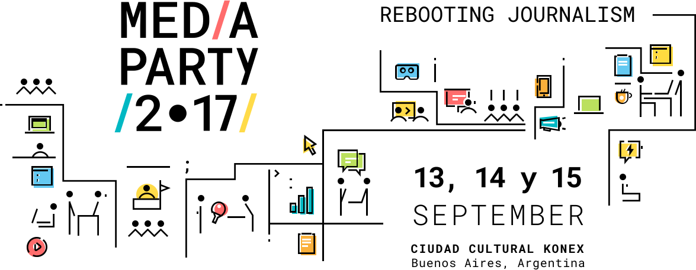

# Welcome to MAGÖProyectos!

### My Index, let's talk about animations.

Let's talk about my psychedelic-power-flower [index](index.html). Beyond the hypnotic background which is such a simply gif, there is something more interesting: the two black balls jumping up and down. 

I based in that code:
```
<!DOCTYPE html>
<html>
<head>
<style> 
div {
    width: 100px;
    height: 100px;
    background-color: red;
    position: relative;
    -webkit-animation-name: example; /* Safari 4.0 - 8.0 */
    -webkit-animation-duration: 4s; /* Safari 4.0 - 8.0 */
    animation-name: example;
    animation-duration: 4s;
}

/* Safari 4.0 - 8.0 */
@-webkit-keyframes example {
    0%   {background-color:red; left:0px; top:0px;}
    25%  {background-color:yellow; left:200px; top:0px;}
    50%  {background-color:blue; left:200px; top:200px;}
    75%  {background-color:green; left:0px; top:200px;}
    100% {background-color:red; left:0px; top:0px;}
}

/* Standard syntax */
@keyframes example {
    0%   {background-color:red; left:0px; top:0px;}
    25%  {background-color:yellow; left:200px; top:0px;}
    50%  {background-color:blue; left:200px; top:200px;}
    75%  {background-color:green; left:0px; top:200px;}
    100% {background-color:red; left:0px; top:0px;}
}
</style>
</head>
<body>

<p><b>Note:</b> This example does not work in Internet Explorer 9 and earlier versions.</p>

<div></div>

</body>
</html>

```

I applied that code just in two divs, I made two animations, changed the colors into black, made the timing function linear, and changed the orientation of one of them. It looks like this:
```
.animacion1{
    width: 30px;
    height: 30px;
    border-radius: 50%;
    background-color: black;
    position: relative;
    -webkit-animation-name: example1; /* Safari 4.0 - 8.0 */
    -webkit-animation-duration: 1s; /* Safari 4.0 - 8.0 */
    -webkit-animation-direction: alternate; /* Safari 4.0 - 8.0 */
    -webkit-animation-timing-function: linear; /* Safari 4.0 - 8.0 */
    -webkit-animation-iteration-count: infinite;
    animation-timing-function: linear;
    animation-iteration-count: infinite;
    animation-name: example1;
    animation-duration: 1s;
    animation-direction: alternate; 
    margin-left: 40px;   
}
@keyframes example1 {
    0%   {background-color:black; left:0px; top:100%;}
    25%  {background-color:black; left:0px; top:75%;}
    50%  {background-color:black; left:0px; top:50%;}
    75%  {background-color:black; left:0px; top:25%;}
    100% {background-color:black; left:0px; top:0%;}
 }   
         

```

Enjoy it and don't get lost hahahaha !!!! https://agottert.github.io/magoProyectos/


### Media Party

The first you'll see is one I made this year in Media Party (such an amazing event!).



The Media Party is a three-day event in Buenos Aires, Argentina, that gathers more than 2500 entrepreneurs, journalists, developers and designers from five continents to work together for the future of media.

For more info: [Media Party 2017, KONEX](http://mediaparty.info/en/)

I worked with the best Ada team in the world: The Pink_px  :dizzy:
We made a quiz we called : Fachometro or Fachoquiz. The quizz will determine if you are a bigot from the right or the left side!
In [media party folder](media_party) you'll only see the layout made with HTML5, CSS and Bootstrap. 
Then one of my mates integrated the JS in the event. It was a success  :muscle: 


### EnjoyVegan (Pink_px Proyect)


The other proyect I'm working on with the wonderful Pink_px is a delivery vegan website. We called it EnjoyVegan. I was in charged of the [footer](footer-contacto_pink_px), the [contact](footer-contacto_pink_px) and [stores](locales_pink_px) of the website. 
